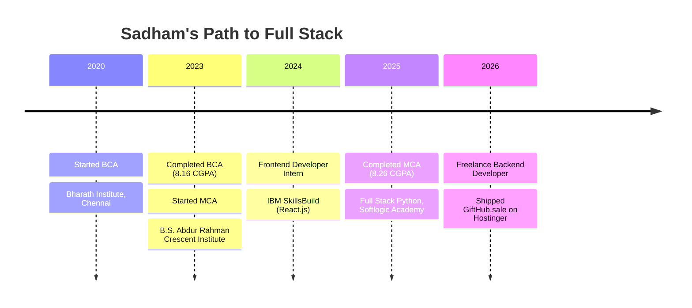

<!-- ============================================================
     PROFILE README — Sadham Hussain R
     Repo name must be exactly: Sadham1412
     ============================================================ -->

<div align="center">


<a href="https://git.io/typing-svg">
  
</a>

<br/>


<br/><br/>

<a href="https://sadhamportfolio.vercel.app"></a>
<a href="https://www.linkedin.com/in/sadham-hussain"></a>
<a href="mailto:sadhamhussain.cbcs@gmail.com"></a>
<a href="https://github.com/Sadham1412"></a>
<a href="https://gifthub.sale"></a>

</div>


<!-- ====================== PROFESSIONAL SUMMARY ====================== -->

<h2 align="center">👨‍💻 Professional Summary</h2>

<table align="center">
<tr>
<td width="58%" valign="top">

Aspiring **Python Full Stack Developer** with a strong foundation in frontend and backend development, REST API design, database management, and software engineering principles. Proficient in **Python, Django, REST APIs, SQL, JavaScript, React.js, HTML5, CSS3**, and modern web frameworks. Experienced in designing responsive, user-centric applications, deploying end-to-end web solutions, and managing client-focused freelance projects.

</td>
<td width="42%" valign="top">

```python
class SadhamHussain:
    role     = "Python Full Stack Dev"
    based_in = "Chennai, India 🇮🇳"
    stack    = ["Django", "React",
                "FastAPI", "MySQL"]
    shipped  = "GiftHub.sale 🎁"
    learning = ["FastAPI", "AI apps"]
    open_to  = ["Full-time roles",
                "Freelance work"]
    coffee   = "∞ ☕"
```

</td>
</tr>
</table>


<!-- =========================== TECH STACK =========================== -->

<h2 align="center">🛠️ Technical Skills</h2>

<div align="center">


<br/>


<br/><br/>

| 🧠 Category | ⚙️ Technologies |
|:--|:--|
| **Languages** | `Python` `JavaScript` `SQL` `HTML5` `CSS3` |
| **Frameworks & Libraries** | `Django` `React.js` `FastAPI` `Bootstrap` |
| **Databases & Web Services** | `MySQL` `SQL` `REST APIs` |
| **Tools & Platforms** | `Postman` `Git` `GitHub` `VS Code` `Figma` |

</div>


<!-- ============================ EXPERIENCE ============================ -->

<h2 align="center">💼 Professional & Internship Experience</h2>

### 🧑‍💻 Freelance Python Backend Developer
**Self-Employed** &nbsp;·&nbsp; `Apr 2026 – Jun 2026`

- Developed and deployed **GiftHub.sale** on Hostinger, a full-stack digital gift card and voucher e-commerce platform using Python, Django, MySQL, React.js, HTML, CSS, and JavaScript.
- Integrated secure OTP-based user authentication utilizing SMTP mail services alongside Razorpay payment gateway integration for secure online transactions.
- Engineered a comprehensive admin panel to streamline user management, voucher listings, order tracking, and optimized SQL database query performance.
- Designed robust REST APIs and thoroughly tested endpoints using Postman to ensure high performance, security, and reliability.

### 🎨 Frontend Developer Intern
**IBM SkillsBuild** &nbsp;·&nbsp; `Jun 2024 – Jul 2024`

- Developed responsive web pages using React.js, HTML, CSS, and JavaScript.
- Improved UI responsiveness, accessibility, and cross-browser compatibility across devices.
- Built reusable frontend components and collaborated on web development projects.


<!-- ============================ PROJECTS ============================ -->

<h2 align="center">🚀 Projects</h2>

<table>
<tr>
<td width="50%" valign="top">

### 🎓 Placement Drive Management System
 

`Python` `Django` `SQL` `HTML5` `CSS3` `JavaScript` `Render`

- Developed and deployed a web application tailored for educational institutions and academies to streamline campus recruitment drives.
- Built an intuitive portal for students to explore upcoming placement drives, view job requirements, and submit applications.
- Implemented an admin dashboard for placement officers and recruiters to post job opportunities, track student applications, and manage drive schedules using Django and SQL.

</td>
<td width="50%" valign="top">

### 👁️ Real-Time Action Identification System
 

`Python` `OpenCV` `MediaPipe` `Machine Learning` `Twilio`

- Developed a real-time human activity recognition system using computer vision.
- Implemented fall detection using pose estimation and machine learning techniques.
- Integrated WhatsApp alerts and geolocation support using Twilio API.

</td>
</tr>
<tr>
<td width="50%" valign="top">

### 📱 Online Auction System (Android Application)
 

`Java` `XML` `Firebase`

- Developed an Android app for real-time online bidding and auction management.
- Implemented secure user authentication using Firebase Authentication.
- Managed real-time product listings, bidding, and history using Firebase Realtime Database.

</td>
<td width="50%" valign="top">

### 🎁 GiftHub.sale (Freelance)
 

`Python` `Django` `MySQL` `React.js` `HTML` `CSS` `JavaScript`

- Full-stack digital gift card and voucher e-commerce platform deployed on Hostinger.
- Secure OTP-based authentication via SMTP mail services and Razorpay payment gateway integration.
- Admin panel for user management, voucher listings and order tracking, with REST APIs tested in Postman.

[🌐 **Visit Live Site →**](https://gifthub.sale)

</td>
</tr>
</table>


<!-- ============================ EDUCATION ============================ -->

<h2 align="center">🎓 Education</h2>

<div align="center">

| Degree | Institution | Year | CGPA |
|:--|:--|:--:|:--:|
| **Master of Computer Applications (MCA)** | B.S. Abdur Rahman Crescent Institute of Science and Technology, Chennai | 2023 – 2025 | **8.26 / 10** |
| **Bachelor of Computer Applications (BCA)** | Bharath Institute of Higher Education and Research, Chennai | 2020 – 2023 | **8.16 / 10** |

</div>

<h2 align="center">📜 Certifications</h2>

- ✅ **Full Stack Web Development in Python** (Completed) — Softlogic Academy (SLA), KK Nagar
- ✅ **IBM SkillsBuild** — Frontend Web Development
- ✅ Cloud Computing | Machine Learning | UI/UX Design Fundamentals

<h2 align="center">🧭 My Journey</h2>




<!-- ============================ GITHUB STATS ============================ -->

<h2 align="center">📊 GitHub Analytics</h2>

<div align="center">


<br/>


<br/><br/>


</div>


<!-- ============================= CONTACT ============================= -->

<h2 align="center">📫 Let's Build Something Together</h2>

<div align="center">

I'm open to **full-time Python / Django roles** and **freelance projects**.<br/>
Have an idea or an opportunity? I'd love to hear from you.

<br/>

| 📧 Email | 📞 Phone | 📍 Location |
|:--:|:--:|:--:|
| [sadhamhussain.cbcs@gmail.com](mailto:sadhamhussain.cbcs@gmail.com) | [+91 7448439991](tel:+917448439991) | East Tambaram, Chennai 600059 |

| 💼 LinkedIn | 🐙 GitHub | 🌐 Portfolio |
|:--:|:--:|:--:|
| [linkedin.com/in/sadham-hussain](https://www.linkedin.com/in/sadham-hussain) | [github.com/Sadham1412](https://github.com/Sadham1412) | [sadhamportfolio.vercel.app](https://sadhamportfolio.vercel.app) |

<br/>


<br/>


</div>
