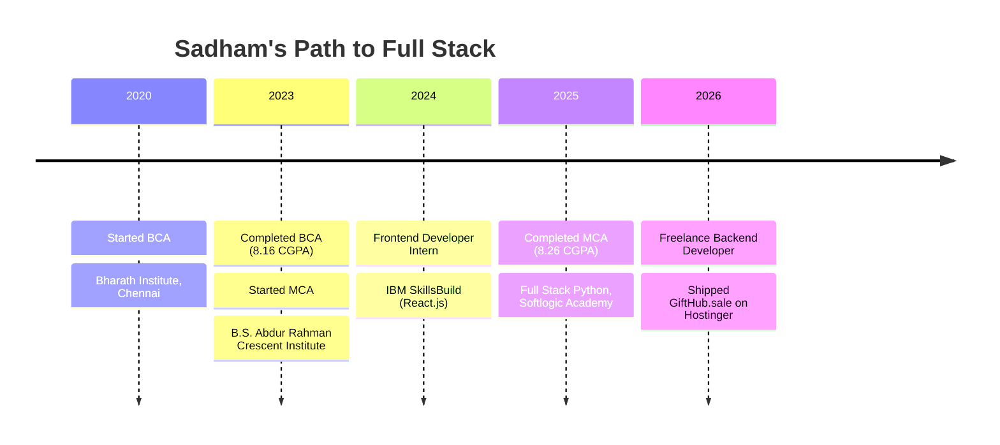

<!-- ============================================================
     PROFILE README — Sadham Hussain R
     Repo name must be exactly: Sadham1412
     ============================================================ -->

<div align="center">


<a href="https://git.io/typing-svg">
  
</a>

<br/>


<br/><br/>

<a href="https://sadhamportfolio.vercel.app"></a>
<a href="https://www.linkedin.com/in/sadham-hussain"></a>
<a href="mailto:sadhamhussain.cbcs@gmail.com"></a>
<a href="https://github.com/Sadham1412"></a>
<a href="https://gifthub.sale"></a>

</div>


<!-- ============================ ABOUT ============================ -->

<h2 align="center">👨‍💻 About Me</h2>

<table align="center">
<tr>
<td width="55%" valign="top">

Hi, I'm **Sadham** — a **Python Full Stack Developer** from **East Tambaram, Chennai** with an **MCA (CGPA 8.26)** and hands-on experience delivering real web applications.

I'm strong across **frontend & backend development, REST API design, database management** and software engineering principles. I build responsive, user-centric apps, deploy them end to end, and have handled **client-focused freelance projects** from idea to production.

> 💡 *"Build • Learn • Create • Improve"*

</td>
<td width="45%" valign="top">

```python
class SadhamHussain:
    role     = "Python Full Stack Dev"
    based_in = "Chennai, India 🇮🇳"
    stack    = ["Django", "React",
                "FastAPI", "MySQL"]
    shipped  = "GiftHub.sale 🎁"
    learning = ["FastAPI", "AI apps"]
    open_to  = ["Full-time roles",
                "Freelance work"]
    coffee   = "∞ ☕"
```

</td>
</tr>
</table>

<h3 align="center">🔭 Right Now</h3>

<div align="center">

| 🔭 Working on | 🌱 Learning | 💬 Ask me about | ⚡ Fun fact |
|:--:|:--:|:--:|:--:|
| Full-stack web apps & AI-powered tools | FastAPI • Advanced Python • DB design | Django • React • REST APIs • Deployment | I shipped a live e-commerce platform as a freelancer |

</div>


<!-- =========================== TECH STACK =========================== -->

<h2 align="center">🛠️ Tech Stack</h2>

<div align="center">


<br/>


<br/><br/>

| 🧠 Category | ⚙️ Technologies |
|:--|:--|
| **Languages** | `Python` `JavaScript` `SQL` `HTML5` `CSS3` `Java` |
| **Backend** | `Django` `FastAPI` `REST APIs` `OTP Auth (SMTP)` |
| **Frontend** | `React.js` `Bootstrap` `Responsive UI` `Reusable Components` |
| **Database & Services** | `MySQL` `Firebase` `Razorpay` `Twilio` |
| **AI / Computer Vision** | `OpenCV` `MediaPipe` `Machine Learning` |
| **Tools & Deployment** | `Git` `GitHub` `Postman` `Figma` `VS Code` `Hostinger` `Render` `Vercel` |

</div>


<!-- ============================ PROJECTS ============================ -->

<h2 align="center">🚀 Featured Projects</h2>

<table>
<tr>
<td width="50%" valign="top">

### 🎁 GiftHub.sale
  

Full-stack **digital gift card & voucher e-commerce platform**, built and deployed end to end.

- 🔐 OTP login via SMTP mail
- 💳 Razorpay payment gateway
- 🛠️ Admin panel: users, vouchers, orders
- 🔗 REST APIs tested with Postman
- 🗄️ Optimized SQL queries

`Python` `Django` `MySQL` `React.js` `REST API`

[🌐 **Visit Live Site →**](https://gifthub.sale)

</td>
<td width="50%" valign="top">

### 🎓 Placement Drive Management System
 

Web app helping colleges & academies run **campus recruitment drives**.

- 👨‍🎓 Student portal: browse drives, apply
- 📊 Admin dashboard for officers & recruiters
- 📝 Application tracking & drive scheduling
- 🔎 Search and filtering

`Python` `Django` `SQL` `HTML5` `CSS3` `JavaScript`

</td>
</tr>
<tr>
<td width="50%" valign="top">

### 👁️ Real-Time Action Identification
 

Recognizes human activity from a live camera feed and **detects falls**, then raises alerts.

- 🧍 Pose estimation + ML
- 🚨 Fall detection
- 💬 WhatsApp alerts via Twilio
- 📍 Geolocation support

`Python` `OpenCV` `MediaPipe` `ML` `Twilio`

</td>
<td width="50%" valign="top">

### 📱 Online Auction System
 

Android app for **real-time bidding** and auction management.

- 🔐 Firebase Authentication
- 🛍️ Live product listings
- 💰 Real-time bidding
- 📊 Bid history (Realtime Database)

`Java` `XML` `Firebase`

</td>
</tr>
</table>


<!-- ============================= JOURNEY ============================= -->

<h2 align="center">🧭 My Journey</h2>



<details>
<summary><b>💼 Experience details (click to expand)</b></summary>

<br/>

**🧑‍💻 Freelance Python Backend Developer** — *Self-Employed* · `Apr 2026 – Jun 2026`
- Developed and deployed **GiftHub.sale** on Hostinger using Python, Django, MySQL, React.js, HTML, CSS and JavaScript
- Integrated **OTP authentication** via SMTP and the **Razorpay** payment gateway
- Built an admin panel for user management, voucher listings and order tracking; optimized SQL query performance
- Designed REST APIs and tested endpoints thoroughly with Postman

**🎨 Frontend Developer Intern** — *IBM SkillsBuild* · `Jun 2024 – Jul 2024`
- Built responsive web pages with React.js, HTML, CSS and JavaScript
- Improved UI responsiveness, accessibility and cross-browser compatibility
- Created reusable frontend components and collaborated on web projects

</details>

<details>
<summary><b>🎓 Education & Certifications (click to expand)</b></summary>

<br/>

| Degree | Institution | Year | CGPA |
|:--|:--|:--:|:--:|
| **MCA** | B.S. Abdur Rahman Crescent Institute of Science and Technology, Chennai | 2023 – 2025 | **8.26** |
| **BCA** | Bharath Institute of Higher Education and Research, Chennai | 2020 – 2023 | **8.16** |

- ✅ Full Stack Web Development in Python — *Softlogic Academy (SLA), KK Nagar*
- ✅ IBM SkillsBuild — Frontend Web Development
- ✅ Cloud Computing • Machine Learning • UI/UX Design Fundamentals

</details>


<!-- ============================ GITHUB STATS ============================ -->

<h2 align="center">📊 GitHub Analytics</h2>

<div align="center">


<br/>


<br/><br/>


<br/>


<br/><br/>

<!-- Contribution snake: needs the workflow in .github/workflows/snake.yml (see notes) -->
<picture>
  <source media="(prefers-color-scheme: dark)" srcset="https://raw.githubusercontent.com/Sadham1412/Sadham1412/output/github-snake-dark.svg" />
  <source media="(prefers-color-scheme: light)" srcset="https://raw.githubusercontent.com/Sadham1412/Sadham1412/output/github-snake.svg" />
  
</picture>

</div>


<!-- ============================= CONTACT ============================= -->

<h2 align="center">📫 Let's Build Something Together</h2>

<div align="center">

I'm open to **full-time Python / Django roles** and **freelance projects**.<br/>
Have an idea or an opportunity? I'd love to hear from you.

<br/>

| 📧 Email | 💼 LinkedIn | 🌐 Portfolio | 📍 Location |
|:--:|:--:|:--:|:--:|
| [sadhamhussain.cbcs@gmail.com](mailto:sadhamhussain.cbcs@gmail.com) | [sadham-hussain](https://www.linkedin.com/in/sadham-hussain) | [sadhamportfolio.vercel.app](https://sadhamportfolio.vercel.app) | East Tambaram, Chennai |

<br/>


<br/>


</div>
